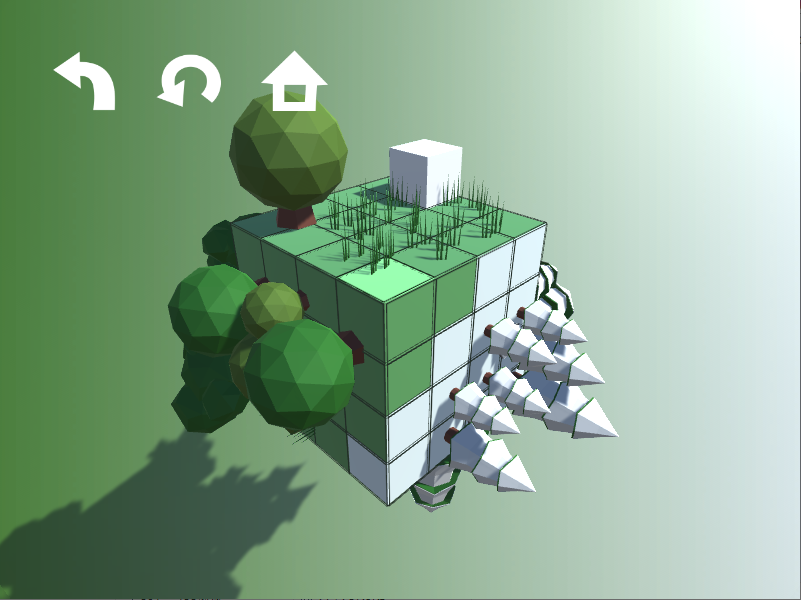
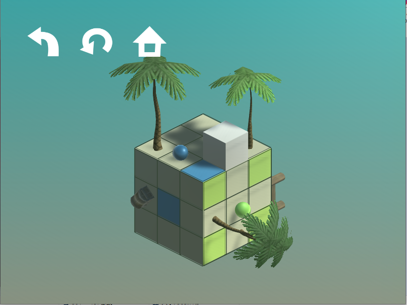

# Daniel's Cube

## 遊戲簡介
Daniel's Cube是一款益智解謎遊戲，由玩家操控小的正方體，填滿大正方體表面指定的顏色區塊即可通關。在以下的預覧圖中，白色小正方體扮演六個面的「印章」，有顏色的小球則扮演「印泥」，玩家須要利用上下左右鍵控制小正方體滾動，到「印泥」上沾染特定顏色，蓋滿大正方體表面閃爍的顏色區塊。另外，玩家可用W、A、S、D、Q、E旋轉大正方體以改變視角，且小正方體的滾動能跨越維度，小正方體碰到障礙物會回彈。

## 遊戲執行解析度
800*600

## 遊戲預覧

